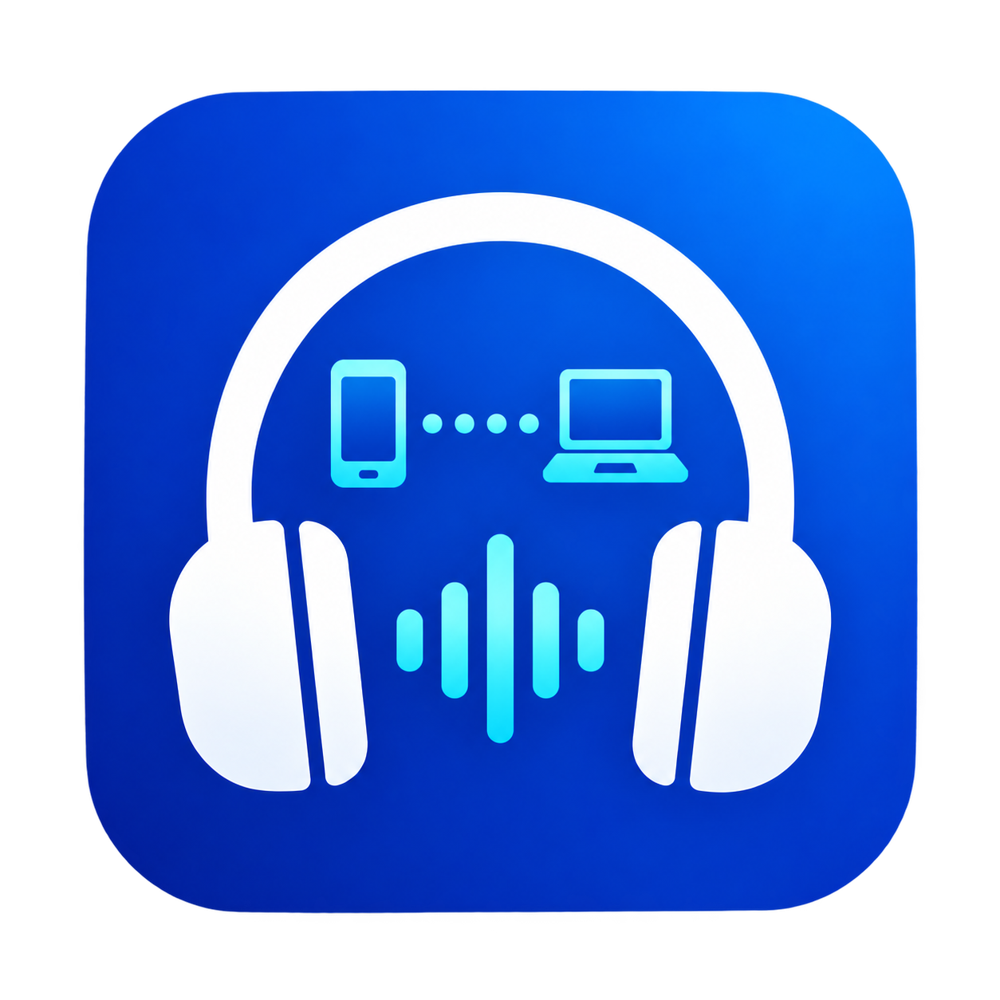

# Better Bluetooth Audio Connector

[简体中文](README.md) | English

<p align="center">
  
</p>

An unpackaged, self-contained WinUI 3 desktop app that turns a Windows PC into a Bluetooth audio receiver. Connect your phone to the PC over Bluetooth and hear the phone's audio through the PC's default output device alongside PC audio.

<p align="center">
  <a href="https://github.com/liubaiqing/BetterBluetoothAudioConnector/releases/latest"><strong>Download the latest installer</strong></a>
</p>

## Features

- Keeps paired audio-capable devices in the list and marks them as checking, nearby, offline, connected, or unknown.
- Opens and closes an audio playback connection with cancellable 5-second Start and 10-second Open stages.
- Retries transient failures once with a fresh connection object.
- Cancels the underlying WinRT operation and isolates late completion results.
- Releases stale connections when devices go offline and restarts device watchers after Bluetooth interruptions.
- Keeps the receiver active while its WinUI 3 desktop window is minimized.
- Supports system media controls and an in-app reconnect action for stalled audio streams.
- Opens with a compact, Per-Monitor V2 DPI-aware interface.
- Writes privacy-preserving diagnostic logs to `%LocalAppData%\BetterBluetoothAudioConnector\Logs` and retains them for seven days.

## Download and install

1. Open the [latest release](https://github.com/liubaiqing/BetterBluetoothAudioConnector/releases/latest).
2. Download `BetterBluetoothAudioConnector-Setup-1.0.0-x64.exe`.
3. Run the installer, choose the language and destination, and select `Install`.
4. Launch the app from the Start Menu or the optional desktop shortcut.

The per-user installer defaults to `%LocalAppData%\Programs\Better Bluetooth Audio Connector`, requires no administrator privileges, and adds a standard Windows uninstall entry.

The current release is not code-signed, so Windows may show an unknown-publisher or SmartScreen warning. Download only from this project's GitHub Releases page and use the accompanying SHA-256 file to verify the package.

## Requirements

- Windows 10 version 2004 (build 19041) or newer, x64.
- The source device must first be paired in Windows Bluetooth settings.
- Target PCs do not need MSIX, .NET, or a separately installed Windows App SDK.
- .NET 8 SDK and Visual Studio 2022 with Windows application development tools are required only for development.

## Build and test

```powershell
dotnet restore .\BetterBluetoothAudioConnector.sln
dotnet build .\BetterBluetoothAudioConnector.sln --configuration Debug --no-restore -p:Platform=x64
dotnet test .\BetterBluetoothAudioConnector.Tests\BetterBluetoothAudioConnector.Tests.csproj --configuration Debug --no-restore -p:Platform=x64
```

## Publish the portable build

```powershell
dotnet publish .\BetterBluetoothAudioConnector\BetterBluetoothAudioConnector.csproj --configuration Release --no-restore -p:Platform=x64
```

The output folder is:

```text
BetterBluetoothAudioConnector\bin\x64\Release\net8.0-windows10.0.19041.0\win-x64\publish
```

Copy or archive the entire folder and run `Better Bluetooth Audio Connector.exe`. The runtime DLL and PRI files beside the executable must remain in place.

## Current limitations

- Only one audio source can be connected at a time; multi-device mixing is not included.
- In-app pairing is not included. Pair devices in Windows Bluetooth settings first.
- A device coming back into range updates its state but is not connected automatically.
- Releases currently target Windows x64 only.

## Build the installer

After installing [Inno Setup 6](https://jrsoftware.org/isdl.php), run:

```powershell
.\installer\Build-Installer.ps1
```

The script publishes the self-contained Release x64 build and packages the complete `publish` directory into:

```text
artifacts\installer\BetterBluetoothAudioConnector-Setup-1.0.0-x64.exe
```

The installer provides English and Simplified Chinese UI, destination selection, a Start Menu shortcut, an optional desktop shortcut, and standard uninstall support. To build another version, pass `-Version 1.1.0`.

## Notes

- The current build is unpackaged and self-contained; it does not install or register MSIX.
- `Package.appxmanifest` and the development certificate remain only as migration history.
